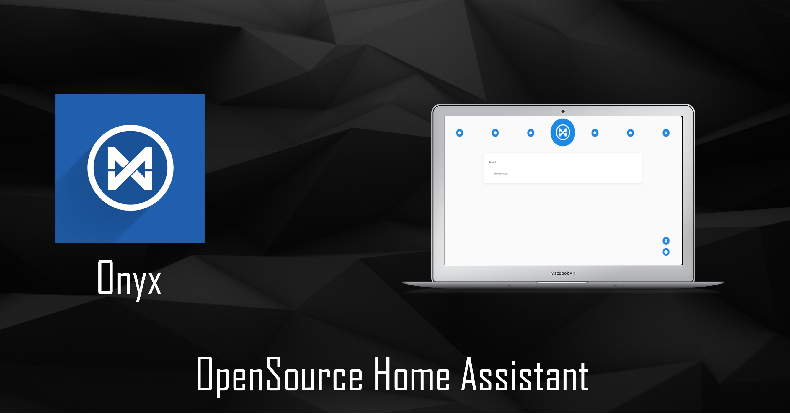

# Onyx AI

<div align="center">
  <!-- Dependency Status -->
  <a href="https://david-dm.org/OnyxAI/onyx">
    
  </a>
  <!-- devDependency Status -->
  <a href="https://david-dm.org/OnyxAI/onyx#info=devDependencies">
    
  </a>
  <!-- Build Status -->
  <a href="https://travis-ci.org/OnyxAI/onyx">
    
  </a>
  <!-- Test Coverage -->
  <a href="https://coveralls.io/r/OnyxAI/onyx">
    
  </a>
</div>



**Website :** [https://onyxlabs.fr](https://onyxlabs.fr)

## Project

Onyx aims to simplify your life, its primary goal is to bring everything together in one place.

Want to check your emails, add appointments, have the weather and set your alarm clocks at the same time? This is the goal of Onyx, to centralize everything.

You go home, you start your computer and your home page is Onyx, then you connect with your personal account and you come across your homepage filled with your widgets that you have chosen beforehand

You decide to launch your favorite music while you check your mails on the mailbox.

Then you will program your alarm clock for the next day with your favorite music to wake you up

The next day, Onyx wakes you up with your music and tells you the time and weather of the day so you can dress up the right way, and gives you your appointments of the day that come directly from your Google account !

## Specifications

Onyx is written in Python with the framework Flask for the backend and it uses React for the frontend

## Prerequisites

All Prerequisites are in the install_debian_script.sh and setup.sh


## Getting Started

The easiest way to install onyx on a Raspberry Pi is to download the Onyx Installer directly from ou website : [https://onyxlabs.fr](https://onyxlabs.fr)

Or to install Onyx manually to contribute :

```bash
git clone https://github.com/OnyxAI/Onyx onyx
```

```bash
cd onyx
```

```bash
sudo bash install_debian_script.sh
```

```bash
bash setup.py
```

That's it !

## Running Onyx Quick Start

To start the essential of Onyx run `./onyx.sh start`. This will open all service (service, neurons, client and voice) 

To stop Onyx run `./onyx.sh stop`. This will quit all screens.
Finally to restart Onyx run './onyx.sh restart`.

Quick screen tips
- run `screen -list` to see all running screens
- run `screen -r [screen-name]` (e.g. `screen -r onyx-service`) to reatach a screen
- to detach a running screen press `ctrl + a, ctrl + d`
See the screen man page for more details

## Start each service manually

You can use the `./start.sh` script !
It use virtualenv so you must execute the `setup.sh` before.
To use it just do this :

- run `./start.sh service`
- run `./start.sh client`
- run `./start.sh neurons`
- run `./start.sh voice`

# FAQ/Common Errors


## Links

- [Website](http://onyxlabs.fr)

## Social Media

[](https://github.com/OnyxAI/Onyx)[](https://hub.docker.com/r/onyxproject/onyx/)[](https://twitter.com/LabsOnyx)